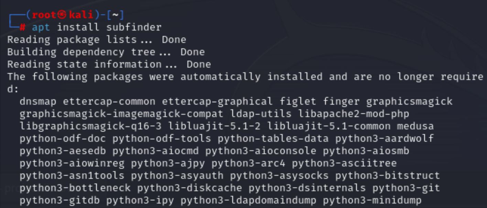
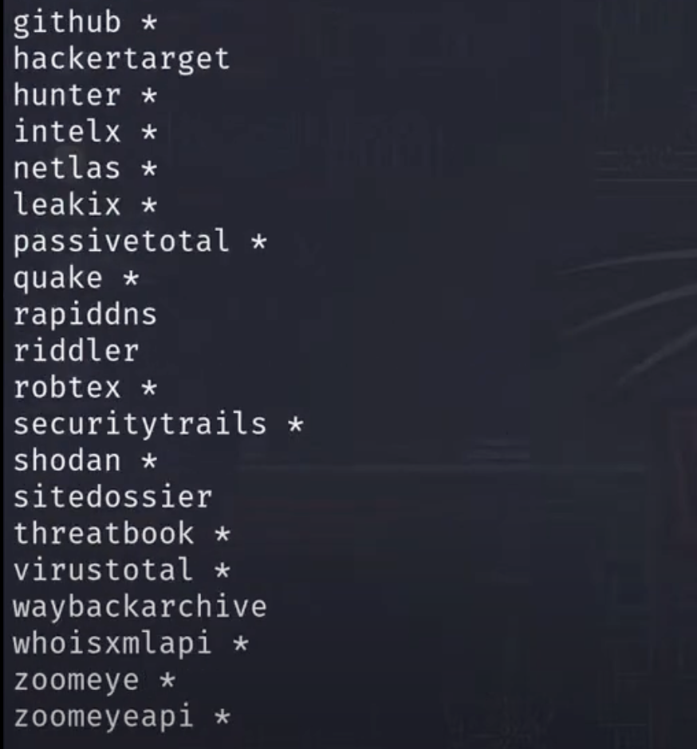
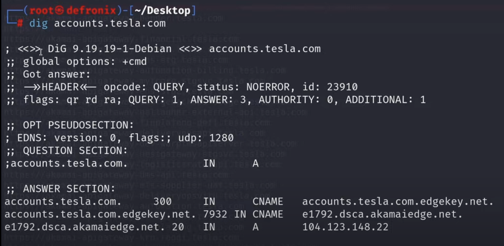

# Subdomain Enummeration

## Steps

## To find subdomains we can use the below tools

1. crt.sh

2. chaos.projectdiscovery.io
   `https://chaos.projectdiscovery.io/#/`

3. ffuf

   `ffuf -c -u https://FUZZ.testwebsite.com -w <wordlist> -mc 200 -rate 100 -v`
   -c is for colorised output
   -u is for added the domain name
   -w is for adding wordlist
   -mc is for status codes
   -rate is for speed of scanning
   -v is vervose mode, it will show the full urls

   **Note:** We can get the wordlist file from "SecLists" github repo: https://github.com/danielmiessler/SecLists/tree/master/Discovery/DNS

4. subfinder
   `apt list subfinder` : To check whether or not subfinder is present in the system
   

   `apt install subfinder` : To install subfinder
   

   **Note:** When we will try to find subdomains using subfinder, we will get limited result. To get more results we will need API keys to be added in the config file.
   `subfinder -ls`: The output will show all the sources which subfinder uses. And if any source contains `*` then it would mean that source needs API keys
   

   **Config file setup**:

   Now we need to add the API keys in the config file.

   Steps:

   1. run `subfinder -ls` command
   2. `cd /root/.config/subfinder`
   3. `ls `
   4. `gedit provider-config.yaml` : Open this config file and add relevant API keys
   5. `subfinder -d <domainName.com> -o output.txt | wc -l`
      -d: is for domain
      -o: is for output
      wc -l: is for counting the lines

## Remove duplicate entries

`sort output.txt | uniq`: this command will sort the file and remove the duplicates

## Find the live subdomains and remove the dead ones

We will use a tool "httpx" for finding the live subdomains

1. `apt list httpx-toolkit` : To check whether or not the this tool is present in the system
2. `apt install httpx-toolkit`
3. `cat suboutput.txt | httpx-toolkit > finaloutput .txt`: after this command is executed the finaloutput.txt file will conain the the live subdomains only

## Screenshot

We will use "eyewitness" tool to take screenshots of the subdomains

1. `apt list eyewitness`
2. `apt install eyewitness`
3. `eyewitness -f <finaloutput.txt> --web`

<!--  -->

Now we need to find subdomains of subdomains basically **nested subdomains**

The tool that we can use is **oneforall**

## Oneforall

**Github link:** https://github.com/shmilylty/OneForAll/blob/master/docs/en-us/README.md

<!--  -->

Now we need to do **directory brute forcing**

1. **Ffuf** tool

`ffuf -w <wordlist-file-location> -u <url> -mc 200`
<wordlist-file-location>: /usr/share/wordlists/dirb/big.txt

2. **dirsearch** tool: with this tool we can pass the file which contains all the subdomain rules

`apt install dirsearch`

`dirsearch -l <urlList.txt> -e php,asp,aspx,html -i 200,404`
-e is used for file extentions
-i is used for status codes

<!--  -->

**subdomain takeover article: (IMP)**

https://www.linkedin.com/pulse/how-takeover-subdomain-eman-%2525C4%252587ati%2525C4%252587-hjqzf%3FtrackingId=%252FF2cgDHHvNB3zFqxq%252BHptA%253D%253D/?trackingId=%2FF2cgDHHvNB3zFqxq%2BHptA%3D%3D

<!--  -->

**A record** :An A Record maps a hostname to one or more IP addresses

**CNAME** :CNAME record maps a hostname to another hostname

<!--  -->

**How to check CNAME OF any domain/subDomain**

**Steps:**

1.  Go to linux terminal
2.  Use this command:
    `dig <domainName>` or `nslookup <domainName>`
    Output:
    

**How to find subdomain takeover vuln**

1. Find out the subdomains which are giving 404 error page
2. Go to linux terminal
3. Use this command: `dig <SubdomainName>`
4. Check the CNAME of that SubdomainName
5. Go to this github repo to check if the CNAME service is vulnerable or not
   https://github.com/EdOverflow/can-i-take-over-xyz

**Subjack tool:** Its a tool to scan a list of subdomains concurrently and identify ones that are able to be hijacked

**NUCLEI tool**

https://www.youtube.com/watch?v=E5djR98tXwE&t=2936s&ab_channel=DefronixAcademy from 1:30:00

<!--  -->

## Sensitive Data From Java Script Files, Live Recon

**JS files analysis for secret information/leakage**

**Steps:**

1. Find a target - domain

2. FInd all the possible subdomains

3. The keywords we need to look for are:

   `key | passwd | pwd | heroku | slack | firebase | swagger | aws_secret_key | password | ftp password | jdbc | db | sql | secret jet | config | admin | pwd | json | gcp | htaccess | .env | ssh key | .git | access key | secret token | oauth_token | oauth_token_secret`

4. We will find all the .js files that are present in the subdomains with the help of tools

   **GetJS tool:** subjs fetches javascript files from a list of URLS or subdomains.
   Link: https://github.com/003random/getJS

   **Katana tool:**
   Link: https://github.com/projectdiscovery/katana

   Installation: `go install github.com/projectdiscovery/katana/cmd/katana@latest`

   Usage:

   **URL Input:** `katana -u https://tesla.com -jc | grep ".js$"`

   **Multiple URL Input (comma-separated):** `katana -u https://tesla.com,https://google.com -jc | grep ".js$"`

   **List Input:** `katana -list url_list.txt -jc | grep ".js$" `

   "-jc": will give all the js files

   ".js$": will even more filer out to give files ending with .js

5. Now we will find the secrets from those .js files using tool

   **secretFinder** Link: https://github.com/m4ll0k/SecretFinder

   Command: It will also include lil bit of automations

   `cat UrlFile.txt | while read url; do python3 SecretFinder/SecretFinder.py -i $url -o cli > secrets.txt; done`

   **Mantra** Link: https://github.com/MrEmpy/mantra

<!--  -->
